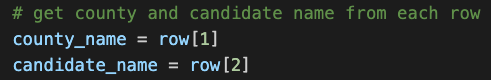

# Election Analysis

## Project Overview

A Colorado Board of Elections employee has given the following tasks to be completed in an audit of a recent congressional election.

1. Calculate the total number of votes cast.
2. Get complete lists of candidates who received votes and counties that participated in the election.
3. Calculate the total number of votes from each county.
4. Calculate the percentage of votes from each county.
5. Determine the county with the largest percentage of vote.
6. Calculate the total number of votes each candidate received.
7. Calculate the percentage of votes each candidate received.
8. Determine the winner of the election based on popular vote.

## Resources
   - Data source: election_results.csv
   - Software: Python 3.7.6, Visual Studio Code 1.57.1

## Election Audit Results

The analysis of the election shows that:
1. There were 369,711 total votes cast in the election.
2. The counties represented in this election were:
	- Jefferson County with 10.5% of the vote and 38,855 total votes.
	- Denver County with 82.8% of the vote and 306,055 total votes.
	- Arapahoe County with 6.7% of the vote and 24,801 total votes.
3. Denver County saw the largest voter turnout with 82.8% of the total votes cast and 306,055 total votes.
4. The candidates were:
	- Charles Casper Stockham
	- Diana DeGette
	- Raymon Anthony Doane
5. The results of the election were:
	- Charles Casper Stockham received 23.0% of the vote and 85,213 total votes.
	- Diana DeGette received 73.8% of the vote and 272,892 total votes.
	- Raymon Anthony Doan received 3.1% of the vote and 11,606 total votes.
6. The winner of the election was:
	- Diana DeGette, with 73.8% of the vote and 272,892 total votes.

The following is an image of election_analysis.txt, an output of the election results produced by the script.

## Election Audit Summary

The script written for this analysis can be used with any number of candidates and any number of counties. With modifications, the script can be applied to any election, provided the data is similarly laid out to this one. Potential modifications include:

- Rewriting the lines of code that record the candidate and county for each vote, such that the code first finds the indices for those fields by looking through the data's header. This would allow the script to work regardless of how the data is organized (e.g., the candidate name could come before the county name and the script would still function).
	

	
- Editing the text so that it refers not to counties but to other types of regions (e.g., states).

- Adjusting the calculation of the winner for elections in which the winner needs a particular number of votes or a particular percentage of the vote.
